# Agency Data Onboarding Kit

> **Turn messy client data into clean, actionable intelligence in under 30 minutes**

A complete toolkit for AI automation agencies to onboard client data without the manual headache. Built by the [Billion community](https://billion.community) for agency operators who want to ship fast and iterate publicly.

[](https://colab.research.google.com/github/billiondottech/agency-data-onboarding-kit/blob/main/notebooks/learn_polars_cleaning.ipynb)
[](https://opensource.org/licenses/MIT)

---

## 🎯 The Problem

Every AI agency faces this on day one with a new client:

**"Can you send us your contact data?"**

What arrives is chaos:
- Excel files with merged cells and color-coded columns
- Countries as "UK", "GB", "United Kingdom", "U.K."
- Phone numbers in 17 different formats
- Duplicate contacts (is Sarah Johnson the same as S. Johnson?)
- Generic emails mixed with decision-makers

Your team spends **hours (sometimes days)** cleaning this manually. Every. Single. Time.

## ✨ The Solution

This kit gives you a **reusable pipeline** that:
- ✅ Accepts any CSV export (Google Sheets, HubSpot, Excel)
- ✅ Automatically cleans, standardizes, and deduplicates
- ✅ Loads into a proper database (Supabase)
- ✅ Generates a human-readable report
- ✅ Runs in under 5 minutes per client

**Before**: 4 hours of manual Excel hell  
**After**: Drop CSV → Click Run → Clean data in 3 minutes

---

## 📦 What's Included

### 1. **Interactive Learning Notebook** 📓
Start here! A Google Colab notebook that teaches you Polars interactively.
- Upload your own messy CSV
- See each transformation step-by-step
- Understand the logic before automating
- **[👉 Open in Colab](link-to-notebook)**

### 2. **Production Scripts** 🐍
Ready-to-run Python scripts for automation:
- `clean_accounts.py` - Company data cleaning
- `clean_contacts.py` - Contact data cleaning
- `utils.py` - Reusable transformation functions

### 3. **n8n Workflow** 🔄
Visual automation that orchestrates everything:
- Watch folder for new CSVs
- Run cleaning scripts
- Load to Supabase
- Generate run reports
- **Importable JSON** - just drag and drop

### 4. **Supabase Schema** 🗄️
Production-ready database schema:
- `accounts` table (companies)
- `contacts` table (people)
- `do_not_contact` table (compliance)
- Proper indexes and foreign keys

### 5. **Sample Data** 📊
Realistic messy CSVs to practice with:
- `accounts_messy.csv` - 20 companies with chaos
- `contacts_messy.csv` - 41 contacts with duplicates
- `hubspot_contacts.csv` - HubSpot export format

### 6. **Complete Playbook** 📖
12-page guide covering:
- Why this stack (Polars + n8n + Supabase)
- Step-by-step setup instructions
- Troubleshooting common issues
- Security & compliance best practices

---

## 🚀 Quick Start

### Option 1: Learn First (Recommended)
**Time: 15 minutes**

1. **[Open the Colab notebook](link-to-notebook)**
2. Upload `samples/contacts_messy.csv`
3. Run each cell and see the magic happen
4. Understand what each transformation does

### Option 2: Full Pipeline Setup
**Time: 30 minutes**

#### Prerequisites
- Python 3.9+
- Docker (for n8n)
- Supabase account (free tier)

#### Step 1: Clone & Install
```bash
git clone https://github.com/billion-community/agency-data-onboarding-kit.git
cd agency-data-onboarding-kit

# Install Python dependencies
cd scripts/
python3 -m venv venv
source venv/bin/activate  # Windows: venv\Scripts\activate
pip install -r requirements.txt
```

#### Step 2: Set Up Supabase
1. Create project at [supabase.com](https://supabase.com)
2. Run `supabase/schema.sql` in SQL Editor
3. Copy your project URL and API key

#### Step 3: Configure Environment
```bash
cp .env.example .env
# Edit .env with your Supabase credentials
```

#### Step 4: Start n8n
```bash
docker run -it --rm \
  --name n8n \
  -p 5678:5678 \
  -v ~/.n8n:/home/node/.n8n \
  n8nio/n8n
```

#### Step 5: Import Workflow
1. Open `http://localhost:5678`
2. Import `n8n/workflow_onboarding.json`
3. Configure Supabase credentials in n8n

#### Step 6: Run Your First Pipeline
```bash
# Copy sample data
cp samples/contacts_messy.csv incoming/
cp samples/accounts_messy.csv incoming/

# In n8n, click "Execute Workflow"
# Check results in Supabase Table Editor
```

---

## 🏗️ How It Works

```mermaid
flowchart LR
    A[📁 Messy CSVs] --> B[Polars Cleaning]
    B --> C[Deduplicate]
    C --> D[Validate]
    D --> E[Supabase]
    E --> F[📊 Clean Data]
    B --> G[📄 Run Report]
```



### The Stack

| Component | Purpose | Why This? |
|-----------|---------|-----------|
| **Polars** | Data cleaning engine | 5-10x faster than Pandas, handles messy data gracefully |
| **n8n** | Workflow orchestration | Visual, self-hosted, no monthly fees per client |
| **Supabase** | PostgreSQL database | Built-in API, great UI, free tier works for most agencies |

### The Pipeline (8 Steps)

1. **Intake** - Read CSVs from `/incoming/`
2. **Validate** - Check required columns and data types
3. **Standardize** - Normalize column names, emails, domains
4. **Deduplicate** - Merge duplicate accounts and contacts
5. **Filter** - Remove invalid emails and test data
6. **Enrich** - Add company size/industry (placeholder for now)
7. **Load** - Upsert to Supabase (idempotent)
8. **Report** - Generate summary of what changed

---

## 📊 What Gets Fixed Automatically

### Before Cleaning
```csv
Company Name ,Website,Country 
ACME CORP,https://www.acme-corp.com/about,USA
acme corp,acme-corp.com,United States
```

### After Cleaning
```csv
name,domain,country
Acme Corp,acme-corp.com,United States
(duplicate merged)
```

### Issues Handled
- ✅ Trailing spaces in headers and values
- ✅ Mixed capitalization (ACME vs acme vs Acme)
- ✅ Website format chaos (http://, www., trailing slashes)
- ✅ Country variations (UK/GB/United Kingdom → standardized)
- ✅ Phone format inconsistencies
- ✅ Duplicate detection by domain/email
- ✅ Invalid email filtering
- ✅ Generic emails (info@, test@) flagged
- ✅ Missing data handling

---

## 📁 Repository Structure

```
agency-data-onboarding-kit/
├── README.md                    # You are here
├── notebooks/
│   └── learn_polars_cleaning.ipynb   # Interactive learning
├── scripts/
│   ├── clean_accounts.py        # Account cleaning logic
│   ├── clean_contacts.py        # Contact cleaning logic
│   ├── utils.py                 # Shared utilities
│   └── requirements.txt         # Python dependencies
├── n8n/
│   └── workflow_onboarding.json # Importable workflow
├── supabase/
│   ├── schema.sql               # Database schema
│   └── seed_do_not_contact.sql  # Sample DNC list
├── samples/
│   ├── accounts_messy.csv       # Sample company data
│   ├── contacts_messy.csv       # Sample contact data
│   └── hubspot_contacts.csv     # HubSpot export format
├── incoming/                    # Drop CSVs here
├── runs/                        # Run reports saved here
├── docs/
│   └── playbook.pdf            # Complete 12-page guide
├── .env.example                 # Environment variables template
└── .gitignore
```

---

## 🎓 Learning Path

### For Complete Beginners
1. Read the **[Playbook PDF](docs/playbook.pdf)** (Sections 1-3)
2. Open the **[Colab Notebook](link)** and run with sample data
3. Watch what each transformation does
4. Ask questions in the **[Billion Community](link)**

### For Python-Curious Operators
1. Skim the Playbook (you'll get the concepts quickly)
2. Run the Colab notebook with your own data
3. Modify a few cells to match your needs
4. Set up the full pipeline when ready

### For Technical Folks
1. Clone the repo
2. Read `scripts/clean_contacts.py` (well-commented)
3. Set up n8n + Supabase
4. Run the full pipeline
5. Customize for your stack

---

## 🔧 Customization

### Adding Custom Fields
Edit `supabase/schema.sql`:
```sql
ALTER TABLE accounts ADD COLUMN annual_revenue INTEGER;
```

Update `scripts/clean_accounts.py`:
```python
df = df.with_columns([
    pl.col("revenue").cast(pl.Int32).alias("annual_revenue")
])
```

### Changing Deduplication Logic
In `scripts/utils.py`:
```python
def deduplicate_contacts(df):
    # Your custom logic here
    # Example: prioritize most recent record
    return df.sort("created_at", descending=True).unique(subset=["email"])
```

### Adding New Data Sources
1. Create `scripts/clean_salesforce.py`
2. Add field mapping in `utils.py`
3. Import workflow node in n8n
4. Done!

---

## 🛡️ Security & Compliance

### Data Protection Checklist
- ✅ Never email raw CSVs (use secure file sharing)
- ✅ Purge `/incoming/` after processing
- ✅ Encrypt Supabase connection (built-in)
- ✅ Use `.env` for credentials (never commit)
- ✅ Maintain audit trail (run reports timestamped)

### GDPR/Privacy Notes
- Include `do_not_contact` table for unsubscribes
- Document data retention policy
- Add DPA template for EU/UK clients
- Support right to erasure (delete + add to DNC)

---

## 🐛 Troubleshooting

### "ModuleNotFoundError: No module named 'polars'"
```bash
# Activate your virtual environment first
cd scripts/
source venv/bin/activate
pip install -r requirements.txt
```

### "Supabase connection refused"
- Check `.env` has correct `SUPABASE_URL` and `SUPABASE_KEY`
- Use **anon key**, not service role key
- Ensure project is not paused (Supabase free tier)

### "Duplicate key violation on domain"
Your CSV has duplicate domains in one file. Add debug logging:
```python
duplicates = df.filter(pl.col("domain").is_duplicated())
print(f"⚠️ Duplicates found:\n{duplicates}")
```

### "Too many rows dropped as invalid"
Your column names don't match expected schema. Print columns:
```python
print(f"CSV columns: {df.columns}")
# Update rename dict to match
```

---

## 🗺️ Roadmap

### Current: Module 1 ✅
- Core cleaning pipeline
- Interactive notebook
- Sample data with common issues

### Coming: Module 2 🚧
- Outbound campaign tracking
- Email send/reply logging
- Meeting booking integration

### Future: Module 3 💡
- Client portal dashboard
- "Ask Oliver" AI agent
- Real-time KPIs from Supabase

### Future: Module 4 🔮
- Multi-ICP support
- Multi-tenant architecture
- Advanced enrichment APIs

---

## 🤝 Contributing

We're building this in public with the Billion community!

### How to Contribute
1. **Use it** - run the pipeline with real client data
2. **Share feedback** - what worked? what broke?
3. **Submit issues** - found a bug or edge case?
4. **Improve docs** - make the playbook clearer
5. **Add features** - PRs welcome!

### Community Guidelines
- **Be helpful** - we're all learning together
- **Share wins** - post your before/after results
- **Ask questions** - no question is too basic
- **Give credit** - acknowledge contributions

---

## 💬 Get Help & Connect

### Join the Community
- **📱 WhatsApp Group**: [Join here](link) - Daily discussions, troubleshooting, wins
- **📧 Newsletter**: [Subscribe](link) - Deep dives, case studies, module updates
- **🎓 Course Waitlist**: [Sign up](link) - Full certification program coming soon

### Questions?
- **GitHub Issues**: For bugs and feature requests
- **WhatsApp**: For quick help and community support
- **Email**: hello@billion.community

---

## 📄 License

MIT License - use this however you want! Build on it, sell services with it, modify it, just don't sue us if something breaks. 😊

See [LICENSE](LICENSE) for full details.

---

## 🙏 Acknowledgments

Built with ❤️ by the [Billion community](https://billion-blog.com) - training 1 billion vibecoders to generate over $1 billion in revenue with AI automations.

**Special thanks to:**
- Early testers who broke things and helped us fix them
- Agency operators who shared their messiest CSVs
- The Polars, n8n, and Supabase teams for amazing tools

---

## 🎯 Next Steps

**Right now, before you close this tab:**

1. **[⭐ Star this repo](https://github.com/billiondottech/agency-data-onboarding-kit)** - so you can find it later
2. **[📓 Open the Colab notebook](link)** - see it work in 15 minutes
3. **[💬 Join the community](link)** - share your results, get help

**Ready to run your first pipeline?** Scroll up to [Quick Start](#-quick-start) ⬆️

---

**Questions? Stuck? Want to share your results?**

👉 [Join the Billion WhatsApp community](link)

---

*Agency Data Onboarding Kit v1.0*  
*Stop cleaning data manually. Start building AI automations.*
